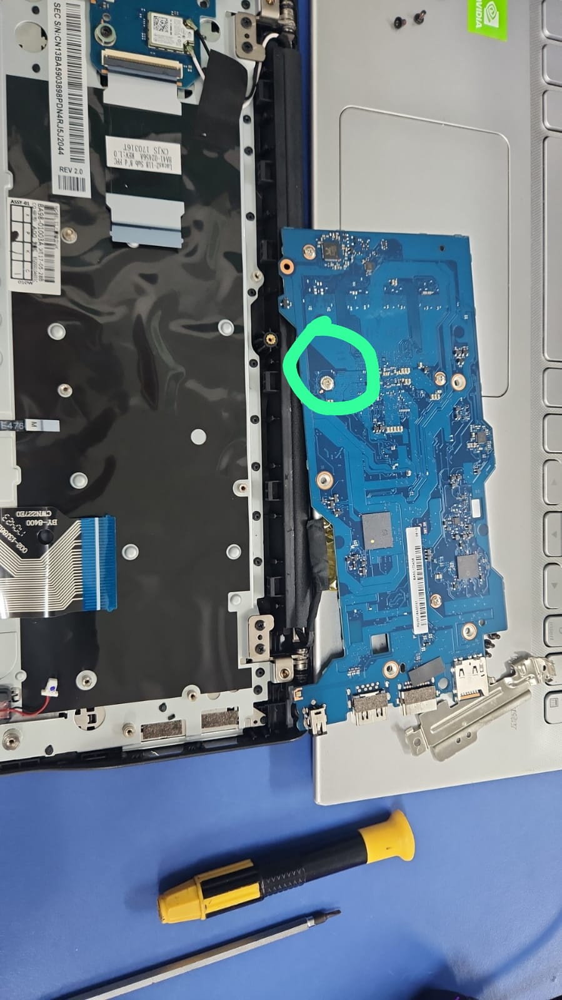
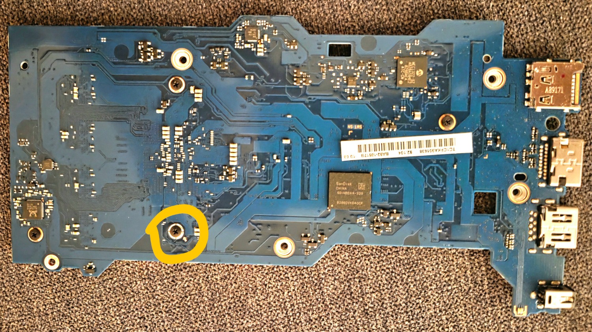

# Projeto Inovatech ChromeCluster.

Guia como transformar o Chromebook em um worker de Docker Swarm utilizando Ubuntu Server.

Versão do Ubuntu Server: [Ubuntu Server 24.04.4 LTS](https://releases.ubuntu.com/24.04/ubuntu-24.04.4-live-server-amd64.iso.torrent) (Link do .torrent)  
Custom Core Boot: [MrChromebox](%20https://docs.mrchromebox.tech/docs/getting-started.html) (Link da Documentação)  
Docker…

## Primeiros passos:

1. ### Liberar a trava de Hardware.

Abra o notebook, tire os cabos flat da placa mãe, pode deixar o do monitor, desparafuse a placa mãe, e por baixo dela, remova o parafuso prata na localização indicada nas fotos e remonte o aparelho.

2. ### Resetar o MDM (Mobile Device Management)

Para resetar o MDM (Mobile Device Management), precisamos fazer login com a conta google abaixo e seguir os passos seguintes:  
	

| E-mail | Senha |
| :---: | :---: |
| i9chromecluster@gmail.com | Consultar com o professor |

1. Conecte ao wi-fi.  
2. Inicie o dispositivo normalmente e faça a configuração padrão logando com a conta acima e senha.  
3. Fazer o Powerwash (Configurações do sistema \> Avançado \> Redefinir Configurações \> Powerwash)  
4. Quando o Powerwash acabar, siga os passos abaixo.

Inicie o Chromebook em [Modo de Rocuperação](https://docs.mrchromebox.tech/docs/boot-modes/recovery.html).  
Pressione Ctrl \+ Refresh \+ Power como na foto exemplo  

