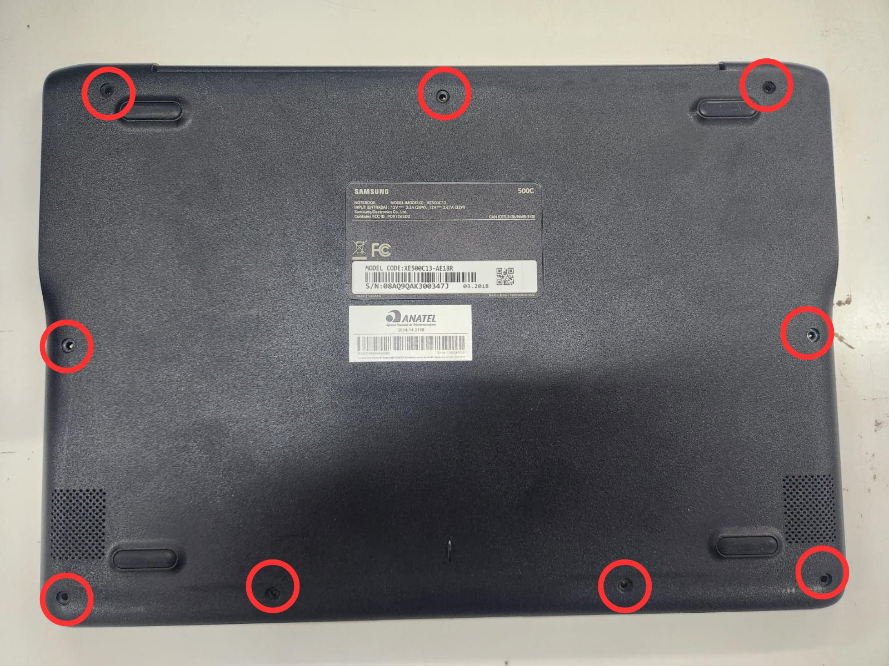
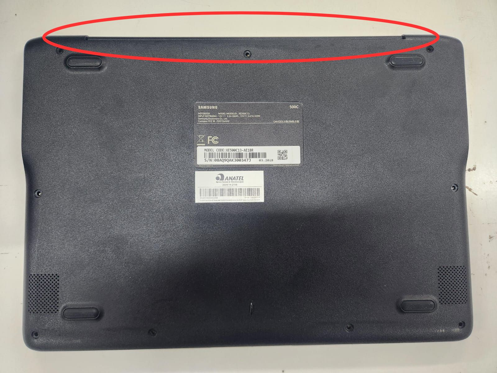
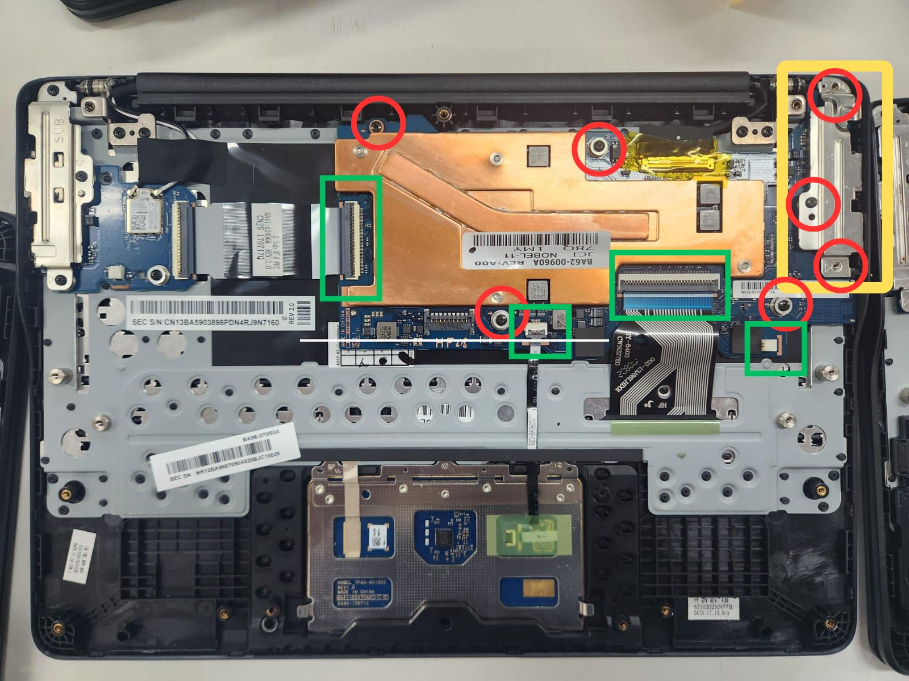

# Modulo 01 - Desbloquear Chromebook

Guia de pre-instalacao para desbloquear o Chromebook e liberar o firmware para boot de outros sistemas operacionais.

## Objetivo

Remover bloqueios fisicos e de firmware para preparar o equipamento para a instalacao do Ubuntu Server.

## Sumario

1. [Liberar a trava de hardware](#1-liberar-a-trava-de-hardware)
2. [Powerwash](#2-powerwash)
3. [Entrar em modo desenvolvedor](#3-entrar-em-modo-desenvolvedor)
4. [Instalar firmware custom](#4-instalar-firmware-custom)

## 1. Liberar a trava de hardware

1. **Remova os parafusos da tampa traseira do notebook.**

2. **Desencaixe a tampa traseira** puxando no vao da conexao com o monitor.

3. **Remova a capa metalica e solte a placa:**
   - Remova a capa metalica dos conectores (amarelo).
   - Remova os parafusos da placa-mae (vermelho).
   - Desconecte os cabos (verde).

> Atenção: nao remova o cabo do monitor. Esse cabo e fragil e pode romper com facilidade.

4. **Remova o parafuso da trava de hardware** (na parte traseira da placa-mae).

5. **Remonte o equipamento** e avance para o proximo passo.

## 2. Powerwash

Nesta etapa, faca login com a conta institucional para resetar o MDM (Mobile Device Management) e transferir o controle do Chromebook.

| E-mail | Senha |
| :---: | :---: |
| i9chromecluster@gmail.com | Consulte alguem da equipe responsavel |

Passos:

1. Conecte o Chromebook ao Wi-Fi.
2. Inicie o dispositivo e conclua a configuracao padrao com a conta acima.
3. Execute o Powerwash: Configuracoes do sistema > Avancado > Redefinir configuracoes > Powerwash.
4. Ao finalizar, siga para o modo desenvolvedor.

## 3. Entrar em modo desenvolvedor

Referencias oficiais:

- [Modo desenvolvedor](https://docs.mrchromebox.tech/docs/boot-modes/developer.html)
- [Modo de recuperacao](https://docs.mrchromebox.tech/docs/boot-modes/recovery.html)

Passos:

1. Inicie o Chromebook em modo de recuperacao.
2. Pressione Ctrl + Refresh + Power conforme a imagem:

## 4. Instalar firmware custom

Em desenvolvimento.

Proximo alvo desta secao:

- Instalar/validar firmware custom do MrChromebox
- Confirmar boot alternativo
- Registrar checklist de sucesso/falha

